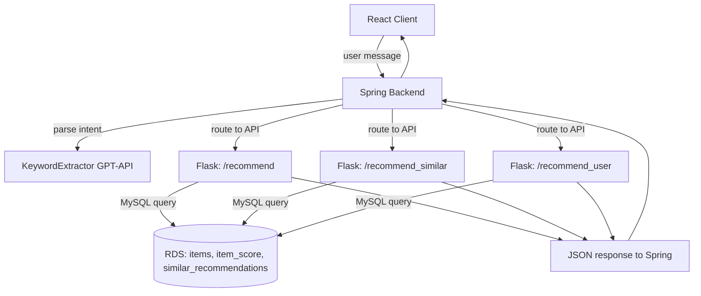

# Ecommerce AI Recommendation Platform

📌 본 프로젝트는 사용자 맞춤형 화장품 추천을 목표로 한 AI 기반 전자상거래 플랫폼입니다.  
프론트엔드, 백엔드, 추천 시스템까지 직접 설계하고 구현하였으며, 세 가지 추천 알고리즘을 Flask API 형태로 제공하고 Spring Boot와 연동됩니다.

---

## 🌐 Overview

- **Frontend**: React.js (with Protected Routes, JWT)
- **Backend**: Spring Boot
- **Recommendation APIs**: Flask + MySQL RDS
- **Database**: AWS RDS (MySQL)
- **Deployment**: 로컬 개발환경 기준

---

## 📦 Features

### 🛍️ 사용자 기능

- 로그인, 회원가입 (JWT 기반 인증)
- 상품 검색 및 목록 조회
- 추천 상품 자동 제공 (3종 API 통합)
- 마이페이지: 내 정보, 찜 목록 관리
- 리뷰 작성, 좋아요, 별점 평가

### 👑 관리자 기능

- 상품 등록 및 삭제
- 사용자 관리
- 추천 API 테스트

---

## 🧭 Frontend (React.js)

- JWT 기반 사용자 인증 및 보호 라우팅
- Axios로 Spring API 통신
- 사용자 인터페이스는 Tailwind + Shadcn
- 루트 구성:
  - `/login`, `/register`
  - `/dashboard`
  - `/recommendation`
  - `/settings`

---

## ⚙️ Backend (Spring Boot)

- 사용자 인증 (JWT 발급/검증)
- 상품 정보 CRUD
- 사용자 리뷰, 별점, 좋아요 처리
- Python Flask 추천 API 연동

---

## 🔍 Recommendation System (Python Flask Integration)

Spring Boot 백엔드는 세 가지 독립적인 **Flask 기반 추천 API**와 연동되어 사용자 맞춤형 추천을 제공합니다:

### 1. **Keyword-based Recommendation**  
📍 **Endpoint**: `POST /recommend` (Flask port 5000)  
📘 **방식**: 사용자가 입력한 키워드 스코어 기반으로 상품을 필터링하고 KMeans 클러스터링을 통해 적합한 제품 추천

- 🔢 입력:  
  ```json
  {
    "추천 유형": "키워드 추천",
    "키워드": {"수분": 1, "유분": -1, ...},
    "카테고리": ["cream"]
  }
  ```
- ⚙️ 처리 과정:
  - MySQL RDS에서 `items` + `item_score` 병합
  - 정규화 후 필터링 (상위 20%만)
  - 클러스터링 + `request_score` 계산 → 가장 적합한 제품 1개 선택

---

### 2. **Similar Product Recommendation**  
📍 **Endpoint**: `POST /recommend_similar` (Flask port 5001)  
📘 **방식**: 입력된 제품명과 카테고리를 기반으로 유사 제품 추천

- 🔢 입력:  
  ```json
  {
    "추천 유형": "유사 추천",
    "productName": "EANVIE 엔비 솔루션 수딩 로션 120ml, 120ml, 2개",
    "category": "cream"
  }
  ```
- ⚙️ 처리 과정:
  - `similar_recommendations` 테이블에서 추천 `item_id` 조회
  - 해당 제품의 상세 정보 반환

---

### 3. **Demographic-based Recommendation**  
📍 **Endpoint**: `POST /recommend_user` (Flask port 5002 or internal batch)  
📘 **방식**: 성별 + 연령대 기반의 `recommendations` 테이블에서 사전 계산된 점수 기반 추천

- 🔢 입력:  
  ```json
  {
    "gender": "여성",
    "age": 25,
    "item_type": "lotion"
  }
  ```
- ⚙️ 처리 과정:
  - `user_dummy_history` + `user_dummy` + `items` 조인
  - `avg_rating` × 0.7 + `review_count`^0.3 × 0.3 점수 계산
  - 카테고리별 최고 점수 제품 1개 추천
  - 별도 저장 및 `recommendations` 테이블로 유지

---

## 🧩 Python API Architecture



---

## 🚀 How to Run

1. Flask 서버 3개 실행 (포트: 5000, 5001, 5002)
2. Spring Boot 백엔드 실행
3. React 프론트엔드 실행 (`npm start`)
4. JWT 및 API 주소는 `.env` 또는 `application.yml`에서 설정

---

## 📌 Notes

- 본 프로젝트는 복합형 캡스톤 및 AI 추천 시스템 실험을 겸하여 진행되었습니다.
- 추천 API는 실제 배포 시 리팩토링 및 모듈화 예정입니다.
- 모든 데이터베이스 접근은 AWS RDS 기반입니다.
